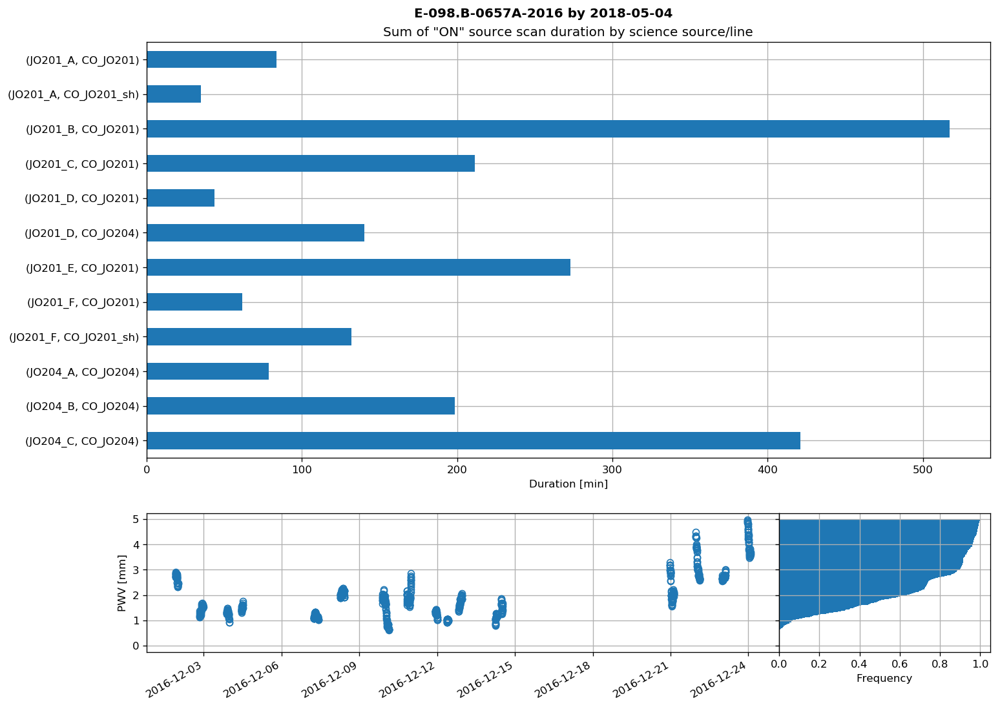

# apexlog
Python script to summarize APEX html logs. At APEX the script can be used on the observing account without any input, it will default to the "standard" catalogs and obslogs of the project.

The script reads the catalogs (.cat/.lin) to define science sources/lines. The obslogs are read in to a pandas.DataFrame for easy procesing/summarising of observed scans. Use ```ipython``` to create more summary statistics.

## Standard example
If not at APEX,  use -c (catalogs) -o (obslogs) to specify where the files are located.

```apexlog -c ~/APEX/projects/JellyFish/e-098.b-0657a-2016 -o ~/APEX/projects/JellyFish/obslogs/```

```
Summarising scan duration by science sources/lines:
                     Duration [min]
source  line                       
JO201_A CO_JO201               66.8
        CO_JO201_sh            18.4
JO201_B CO_JO201              484.0
JO201_C CO_JO201              211.2
JO201_D CO_JO201               43.5
        CO_JO204              140.2
JO201_E CO_JO201              273.1
JO201_F CO_JO201               44.8
        CO_JO201_sh           132.0
JO204_A CO_JO204               61.9
JO204_B CO_JO204              181.7
JO204_C CO_JO204              387.8
```



## Further examples
### List science source scans today and sum of on time
```python
df.set_index('utc', inplace=True)
date = str(pd.datetime.utcnow().date())
date = '2016-12-10'
today = pd.DataFrame(df[(df.source.isin(sci_sources)) &
                        (df.line.isin(sci_lines))][date])
print('\n', date, today['scan_duration'].sum())
print('Observed: ' + date)
print(today.source.value_counts())
```

###  List which dates sources have been observed
```python
df.set_index('utc', inplace=True)
sci = pd.DataFrame(df[(df.source.isin(sci_sources)) &
                      (df.line.isin(sci_lines))])
print(sci.groupby(sci.index.date).source.unique())
```
